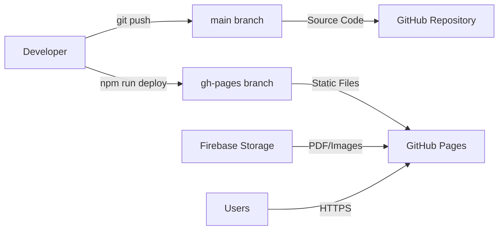

# 서울사대부고 동창회보 디지털 아카이브 프로젝트 명세서

## 📋 프로젝트 개요

### 프로젝트명
**SNUBUGO Magazine Digital Archive** - 서울대학교 사범대학 부설고등학교 동창회보 디지털 아카이브

### 프로젝트 목적
- 서울사대부고 동창회보의 체계적인 디지털 아카이브 구축
- 웹 기반 PDF 뷰어를 통한 온라인 열람 서비스 제공
- 계절별/연도별 분류 시스템을 통한 효율적인 콘텐츠 관리
- **이북 스타일 PDF 뷰어**를 통한 향상된 읽기 경험
- 반응형 웹 디자인을 통한 다양한 디바이스 지원

### 프로젝트 범위
- **아카이브 대상**: 2021년 116호 ~ 2025년 131호 (총 16개 호수)
- **발간 주기**: 분기별 (봄/여름/가을/겨울호)
- **지원 기능**: 기본 PDF 뷰어, 이북 스타일 뷰어, 썸네일 미리보기, 검색/필터링, 반응형 UI

### 배포 URL
- **Production**: https://securil.github.io/snubugo-magazine/
- **Repository**: https://github.com/securil/snubugo-magazine

---

## 🛠️ 기술 스택 및 아키텍처

### Frontend Stack
```yaml
Framework: React 19.1 + TypeScript ~5.8.3
Build Tool: Vite 6.3.5
Styling: Tailwind CSS 3.4.17
PDF Processing: React-PDF 9.2.1 + PDF.js 5.3.31 (문제 해결 필요)
State Management: Local React State (useState)
Routing: React Router DOM 7.6.2 (준비됨, 현재 SPA)
Icons: Lucide React 0.518.0
Fonts: Pretendard Variable (한글 최적화)
```

### Backend & Storage
```yaml
File Storage: Firebase Storage (v11.9.1)
Database: Static JSON metadata (magazines.json)
Authentication: None (Public Access)
CDN: Firebase Storage CDN
Hosting: GitHub Pages
```

### Development & Deployment
```yaml
Package Manager: npm
Linting: ESLint 9.25.0 + TypeScript ESLint 8.30.1
Build System: TypeScript Compiler + Vite Bundler
Version Control: Git (main branch)
Deployment: gh-pages 6.3.0 (Manual)
Branch Strategy: main(source) / gh-pages(deployment)
```

---

## 🏗️ 시스템 아키텍처

### 배포 아키텍처


### 폴더 구조
```
📁 snubugo-magazine/
├── 📁 .github/workflows/           # GitHub Actions (비활성화)
├── 📁 public/                      # 정적 파일
│   ├── 📄 magazines.json          # 메타데이터
│   └── 📄 .nojekyll               # GitHub Pages 최적화
├── 📁 src/                        # React 소스코드
│   ├── 📁 components/             # React 컴포넌트
│   │   ├── 📄 Header.tsx          # 개선된 헤더 (완성)
│   │   ├── 📄 HeroSection.tsx     # 최신호 대형 카드 (완성)
│   │   ├── 📄 RecentIssues.tsx    # 최근호 미리보기 (완성)
│   │   ├── 📄 ArchiveExplorer.tsx # 년도/계절 탐색 (완성)
│   │   ├── 📄 MagazineViewer.tsx  # 기본 PDF 뷰어 (완성)
│   │   ├── 📄 EBookViewer.tsx     # 이북 스타일 뷰어 (개발 중)
│   │   └── 📄 MagazineCard.tsx    # 매거진 카드 (완성)
│   ├── 📁 firebase/               # Firebase 설정
│   ├── 📁 types/                  # TypeScript 타입
│   ├── 📁 utils/                  # 유틸리티 함수
│   │   └── 📄 theme.ts            # 계절별 테마 시스템 (완성)
│   └── 📁 hooks/                  # React Hooks
├── 📁 dist/                       # 빌드 결과물 (gh-pages)
├── 📄 package.json                # 프로젝트 설정
├── 📄 vite.config.ts             # Vite 설정
└── 📄 tailwind.config.cjs        # Tailwind CSS 설정
```

---

## 🎯 핵심 기능 명세

### 1. 기본 PDF 뷰어 시스템 ✅
```yaml
기술: iframe 기반 브라우저 내장 PDF 뷰어
기능:
  - PDF 문서 렌더링
  - PC 환경: 자동 2페이지 뷰 (TwoPageLeft)
  - 모바일 환경: 자동 1페이지 뷰 (FitH)
  - 새 창 열기, 다운로드 지원
  - 안정적이고 빠른 로딩

성능:
  - 즉시 로딩
  - 브라우저 최적화
  - CORS 문제 없음
```

### 2. 이북 스타일 PDF 뷰어 🔄
```yaml
기술: React-PDF + PDF.js (현재 문제 해결 필요)
디자인:
  - 1페이지(표지): 단독 표시 + 3D 효과
  - 2페이지부터: 책 펼침 양면 표시
  - 중앙 바인딩 라인 표시
  - 페이지별 번호 표시
  - 3D 원근감 및 그림자 효과

네비게이션:
  - 표지 → 2-3페이지 → 4-5페이지 순서
  - 키보드 단축키 (←→, +-, 1, ESC)
  - 확대/축소 기능

현재 상태: React-PDF 무한 로딩 문제로 개발 중단
다음 해결 방안: 순수 PDF.js + Canvas 구현 또는 iframe 기반 대체
```

### 3. 콘텐츠 관리 시스템 ✅
```yaml
데이터 구조:
  - 계층형 분류: 연도 > 계절 > 호수
  - 메타데이터: 제목, 설명, 발행일, 태그
  - Firebase Storage URL 연동

필터링:
  - 연도별 필터 (2021-2025)
  - 계절별 필터 (봄/여름/가을/겨울)
  - 실시간 검색 (제목/내용) - 개발 예정
```

### 4. 사용자 인터페이스 ✅
```yaml
디자인 시스템:
  - 계절별 색상 테마 (봄/여름/가을/겨울)
  - 반응형 그리드 레이아웃
  - 모바일 퍼스트 디자인
  - 접근성 지원 (ARIA)
  - Pretendard 폰트 시스템

컴포넌트:
  - Header (브랜딩, 검색, 모바일 메뉴)
  - HeroSection (최신호 대형 카드)
  - RecentIssues (최근 2-3호 미리보기)
  - ArchiveExplorer (년도/계절 탐색)
  - MagazineViewer (기본/이북 뷰어 통합)
```

---

## 📊 데이터 구조

### Magazine 타입
```typescript
interface Magazine {
  id: string;              // "2025-여름-131"
  year: number;            // 2025
  season: Season;          // "여름"
  issue: number;           // 131
  month: number;           // 6
  title: string;           // "2025년 131호 서울사대부고 여름호"
  description: string;     // 상세 설명
  pdfUrl: string;          // Firebase Storage URL
  thumbnailUrl: string;    // Firebase Storage URL
  pageCount: number;       // PDF 페이지 수
  publishDate: string;     // "2025-06-01"
  fileSize: string;        // 파일 크기
  isLatest: boolean;       // 최신호 여부
  featured: boolean;       // 추천 여부
  tags: string[];          // ["여름", "2025", "131호"]
  category: string;        // "동창회보"
}
```

### 계절별 테마 시스템
```typescript
interface SeasonalTheme {
  season: Season;
  colors: {
    primary: string;       // 메인 색상
    secondary: string;     // 보조 색상
    accent: string;        // 강조 색상
    background: string;    // 배경 색상
    gradient: string;      // 그라데이션
    text: string;          // 텍스트 색상
    textSecondary: string; // 보조 텍스트 색상
  };
  icon: string;           // 이모지
  emoji: string;          // 아이콘
  description: string;    // 설명
}
```

---

## 🚀 개발 워크플로우

### 개발 환경 명령어
```bash
# 개발 서버 실행
npm run dev

# TypeScript 타입 체크 + Vite 빌드
npm run build

# 코드 린팅
npm run lint

# 빌드된 파일을 gh-pages 브랜치에 배포
npm run deploy
```

### 배포 프로세스
```yaml
수동 배포 방식:
1. 개발: main 브랜치에서 소스코드 작업
2. 빌드: npm run build로 dist/ 폴더 생성
3. 배포: npm run deploy로 gh-pages 브랜치에 자동 push
4. 서비스: GitHub Pages가 gh-pages 브랜치를 웹사이트로 제공

브랜치 전략:
- main: React/TypeScript 소스코드
- gh-pages: 빌드된 정적 파일들 (자동 관리)
```

---

## 🎨 UI/UX 설계

### 계절별 디자인 시스템
```yaml
봄 테마:
  Primary: #FFB7C5 (벚꽃 핑크)
  Secondary: #98FB98 (연두색)
  Gradient: linear-gradient(135deg, #FFB7C5 0%, #98FB98 100%)
  Description: "새로운 시작과 희망의 계절"

여름 테마:
  Primary: #87CEEB (하늘색)
  Secondary: #F0E68C (연한 노란색)
  Gradient: linear-gradient(135deg, #87CEEB 0%, #F0E68C 100%)
  Description: "활기찬 에너지와 성장의 계절"

가을 테마:
  Primary: #DEB887 (갈색)
  Secondary: #FF8C00 (주황색)
  Gradient: linear-gradient(135deg, #DEB887 0%, #FF8C00 100%)
  Description: "성숙과 결실의 계절"

겨울 테마:
  Primary: #B0C4DE (연한 파랑)
  Secondary: #F8F8FF (거의 흰색)
  Gradient: linear-gradient(135deg, #B0C4DE 0%, #F8F8FF 100%)
  Description: "고요한 성찰과 준비의 계절"
```

### 반응형 브레이크포인트
```css
모바일: 0px - 768px     (1열 그리드, 1페이지 뷰)
태블릿: 768px - 1200px  (2열 그리드, 1페이지 뷰)
PC: 1200px+            (3-4열 그리드, 2페이지 뷰)
```

---

## 🔒 보안 및 성능

### 보안 고려사항
```yaml
인증: 불필요 (공개 아카이브)
데이터 보호: Firebase Security Rules
HTTPS: GitHub Pages 기본 제공
XSS 방지: React 기본 보안
```

### 성능 최적화
```yaml
현재 번들 사이즈: ~600KB (gzipped: ~180KB)
목표 번들 사이즈: <300KB (React-PDF 문제 해결 후)

최적화 적용:
  - Vite Tree Shaking
  - 이미지 지연 로딩
  - Firebase Storage CDN
  - CSS 최적화
  - TypeScript 컴파일 최적화

추가 최적화 계획:
  - Code Splitting
  - 서비스 워커 캐싱
  - PWA 기능
```

---

## 📈 확장 계획

### Phase 2 기능 (개발 중)
- ✅ 계절별 테마 시스템
- ✅ 이북 스타일 레이아웃
- 🔄 이북 스타일 PDF 뷰어 (React-PDF 문제 해결 필요)
- ⏳ 실시간 검색 기능 고도화

### Phase 3 기능 (계획)
- 북마크 시스템
- 다크/라이트 모드
- 소셜 공유 기능
- 키보드 단축키 고도화

### Phase 4 기능 (미래)
- 관리자 패널
- 자동 PDF 업로드
- 댓글 시스템
- 다국어 지원
- PWA 기능

---

## ⚠️ 현재 알려진 문제점

### 1. React-PDF 무한 로딩 문제
```yaml
문제: EBookViewer에서 React-PDF 컴포넌트 무한 로딩
원인: PDF.js Worker 설정 또는 Firebase Storage CORS 이슈
영향: 이북 스타일 뷰어 사용 불가
해결 방안:
  - 옵션 1: 순수 PDF.js + Canvas 구현
  - 옵션 2: iframe 기반 고급 뷰어
  - 옵션 3: 대체 PDF 라이브러리 사용
```

### 2. 번들 사이즈 최적화 필요
```yaml
현재: ~600KB (React-PDF 포함)
목표: <300KB
방법: React-PDF 제거 및 경량 대안 구현
```

---

## 🎯 다음 개발 우선순위

1. **최우선**: React-PDF 문제 해결 및 이북 뷰어 완성
2. **중요**: 검색 기능 구현
3. **권장**: 성능 최적화 및 번들 사이즈 감소
4. **선택**: 고급 기능 (북마크, 다크모드 등)

---

**문서 버전**: 3.0.0  
**최종 업데이트**: 2025.06.21  
**작성자**: securil  
**프로젝트 상태**: Phase 2 진행 중 (이북 뷰어 문제 해결 필요)
