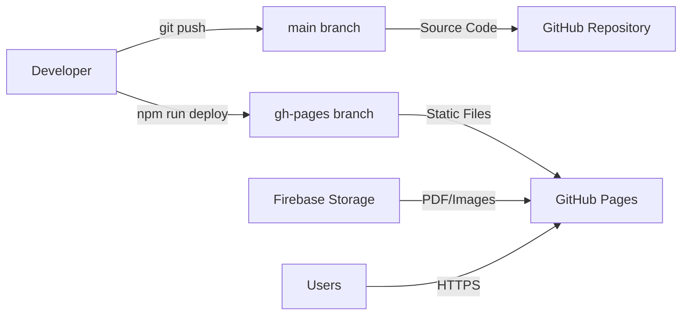

# 서울사대부고 동창회보 디지털 아카이브 프로젝트 명세서

## 📋 프로젝트 개요

### 프로젝트명
**SNUBUGO Magazine Digital Archive** - 서울대학교 사범대학 부설고등학교 동창회보 디지털 아카이브

### 프로젝트 목적
- 서울사대부고 동창회보의 체계적인 디지털 아카이브 구축
- 웹 기반 PDF 뷰어를 통한 온라인 열람 서비스 제공
- 계절별/연도별 분류 시스템을 통한 효율적인 콘텐츠 관리
- 반응형 웹 디자인을 통한 다양한 디바이스 지원

### 프로젝트 범위
- **아카이브 대상**: 2021년 116호 ~ 2025년 131호 (총 16개 호수)
- **발간 주기**: 분기별 (봄/여름/가을/겨울호)
- **지원 기능**: PDF 뷰어, 썸네일 미리보기, 검색/필터링, 반응형 UI

### 배포 URL
- **Production**: https://securil.github.io/snubugo-magazine/
- **Repository**: https://github.com/securil/snubugo-magazine

---

## 🛠️ 기술 스택 및 아키텍처

### Frontend Stack
```yaml
Framework: React 19.1 + TypeScript ~5.8.3
Build Tool: Vite 6.3.5
Styling: Tailwind CSS 3.4.17
PDF Processing: React-PDF 9.2.1 + PDF.js 5.3.31
State Management: Local React State (useState)
Routing: React Router DOM 7.6.2 (준비됨, 현재 SPA)
Icons: Lucide React 0.518.0
```

### Backend & Storage
```yaml
File Storage: Firebase Storage (v11.9.1)
Database: Static JSON metadata (magazines.json)
Authentication: None (Public Access)
CDN: Firebase Storage CDN
Hosting: GitHub Pages
```

### Development & Deployment
```yaml
Package Manager: npm
Linting: ESLint 9.25.0 + TypeScript ESLint 8.30.1
Build System: TypeScript Compiler + Vite Bundler
Version Control: Git (main branch)
Deployment: gh-pages 6.3.0 (Manual)
Branch Strategy: main(source) / gh-pages(deployment)
```

---

## 🏗️ 시스템 아키텍처

### 배포 아키텍처


### 폴더 구조
```
📁 snubugo-magazine/
├── 📁 .github/workflows/           # GitHub Actions (비활성화)
├── 📁 public/                      # 정적 파일
│   ├── 📄 magazines.json          # 메타데이터
│   └── 📄 .nojekyll               # GitHub Pages 최적화
├── 📁 src/                        # React 소스코드
│   ├── 📁 components/             # React 컴포넌트
│   ├── 📁 firebase/               # Firebase 설정
│   ├── 📁 types/                  # TypeScript 타입
│   └── 📁 utils/                  # 유틸리티 함수
├── 📁 dist/                       # 빌드 결과물 (gh-pages)
├── 📄 package.json                # 프로젝트 설정
├── 📄 vite.config.ts             # Vite 설정
└── 📄 tailwind.config.cjs        # Tailwind CSS 설정
```

---

## 🎯 핵심 기능 명세

### 1. PDF 뷰어 시스템
```yaml
기술: React-PDF + PDF.js
기능:
  - PDF 문서 렌더링
  - 페이지 네비게이션 (이전/다음)
  - 확대/축소 (25% ~ 300%)
  - 전체화면 모드
  - 페이지 점프
  - 로딩 상태 처리
  - 에러 처리

성능:
  - 지연 로딩 (Lazy Loading)
  - PDF.js Worker 최적화
  - 메모리 효율적 렌더링
```

### 2. 콘텐츠 관리 시스템
```yaml
데이터 구조:
  - 계층형 분류: 연도 > 계절 > 호수
  - 메타데이터: 제목, 설명, 발행일, 태그
  - Firebase Storage URL 연동

필터링:
  - 연도별 필터 (2021-2025)
  - 계절별 필터 (봄/여름/가을/겨울)
  - 실시간 검색 (제목/내용)
```

### 3. 사용자 인터페이스
```yaml
디자인 시스템:
  - 계절별 색상 테마
  - 반응형 그리드 레이아웃
  - 모바일 퍼스트 디자인
  - 접근성 지원 (ARIA)

컴포넌트:
  - Header (브랜딩, 검색)
  - MagazineList (목록, 필터)
  - MagazineCard (개별 카드)
  - MagazineViewer (PDF 뷰어)
```

---

## 📊 데이터 구조

### Magazine 타입
```typescript
interface Magazine {
  id: string;              // "2025-여름-131"
  year: number;            // 2025
  season: Season;          // "여름"
  issue: number;           // 131
  month: number;           // 6
  title: string;           // "2025년 131호 서울사대부고 여름호"
  description: string;     // 상세 설명
  pdfUrl: string;          // Firebase Storage URL
  thumbnailUrl: string;    // Firebase Storage URL
  pageCount: number;       // PDF 페이지 수
  publishDate: string;     // "2025-06-01"
  fileSize: string;        // 파일 크기
  isLatest: boolean;       // 최신호 여부
  featured: boolean;       // 추천 여부
  tags: string[];          // ["여름", "2025", "131호"]
  category: string;        // "동창회보"
}
```

### Firebase Storage 구조
```
Firebase Storage:
├── 📁 pdfs/
│   ├── 📄 2021년 116호-서울사대부고 봄호.pdf
│   ├── 📄 2021년 117호-서울사대부고 여름호.pdf
│   └── ... (16개 PDF 파일)
└── 📁 thumbnails/
    ├── 🖼️ 2021년 116호-서울사대부고 봄호.png
    ├── 🖼️ 2021년 117호-서울사대부고 여름호.png
    └── ... (16개 썸네일 이미지)
```

---

## 🚀 개발 워크플로우

### 개발 환경 명령어
```bash
# 개발 서버 실행
npm run dev

# TypeScript 타입 체크 + Vite 빌드
npm run build

# 코드 린팅
npm run lint

# 빌드된 파일을 gh-pages 브랜치에 배포
npm run deploy
```

### 배포 프로세스
```yaml
수동 배포 방식:
1. 개발: main 브랜치에서 소스코드 작업
2. 빌드: npm run build로 dist/ 폴더 생성
3. 배포: npm run deploy로 gh-pages 브랜치에 자동 push
4. 서비스: GitHub Pages가 gh-pages 브랜치를 웹사이트로 제공

브랜치 전략:
- main: React/TypeScript 소스코드
- gh-pages: 빌드된 정적 파일들 (자동 관리)
```

---

## 🎨 UI/UX 설계

### 디자인 시스템
```yaml
색상 팔레트:
  봄: 연분홍, 연두색 계열
  여름: 하늘색, 노란색 계열  
  가을: 주황색, 갈색 계열
  겨울: 파란색, 회색 계열

타이포그래피:
  제목: 24px-32px, 볼드
  본문: 14px-16px, 일반
  캡션: 12px-14px, 회색

레이아웃:
  모바일: 1열 그리드
  태블릿: 2열 그리드
  데스크톱: 3-4열 그리드
```

### 반응형 브레이크포인트
```css
모바일: 0px - 768px
태블릿: 768px - 1024px
데스크톱: 1024px+
```

---

## 🔒 보안 및 성능

### 보안 고려사항
```yaml
인증: 불필요 (공개 아카이브)
데이터 보호: Firebase Security Rules
HTTPS: GitHub Pages 기본 제공
XSS 방지: React 기본 보안
```

### 성능 최적화
```yaml
이미지 최적화:
  - 썸네일 압축
  - Lazy Loading
  - WebP 형식 지원

번들 최적화:
  - Vite Tree Shaking
  - Code Splitting
  - 압축 (gzip)

로딩 성능:
  - PDF 스트리밍
  - 프리로딩
  - 캐싱 전략
```

---

## 📈 확장 계획

### Phase 2 기능
- 실시간 검색 기능 고도화
- 북마크 시스템
- 다크/라이트 모드
- 소셜 공유 기능

### Phase 3 기능
- 관리자 패널
- 자동 PDF 업로드
- 댓글 시스템
- 다국어 지원

---

**문서 버전**: 2.0.0  
**최종 업데이트**: 2025.06.20  
**작성자**: securil  
**프로젝트 상태**: Phase 1 완료 (MVP 배포됨)
